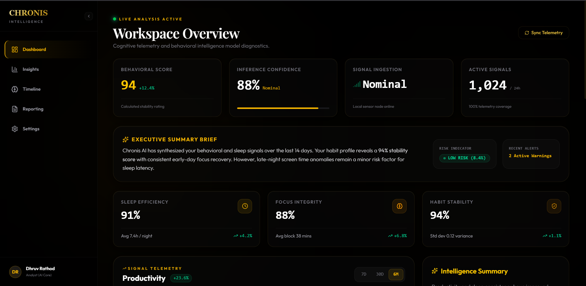
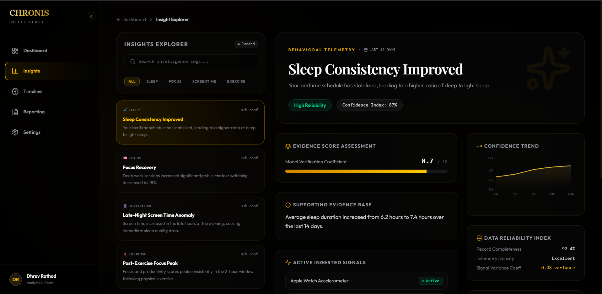
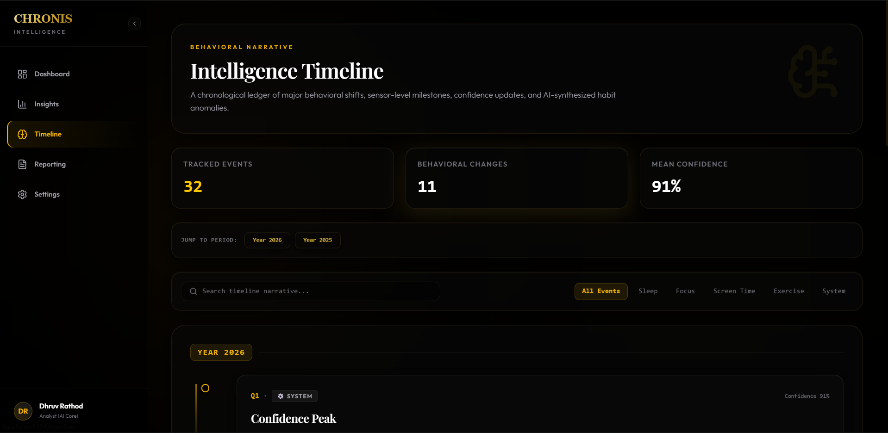
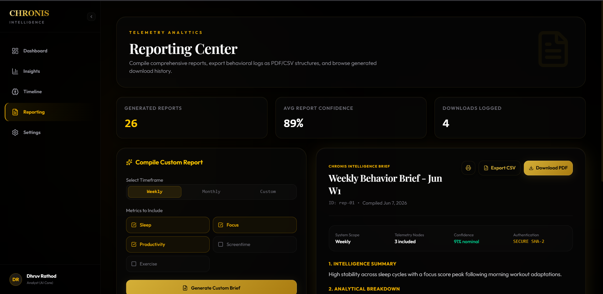
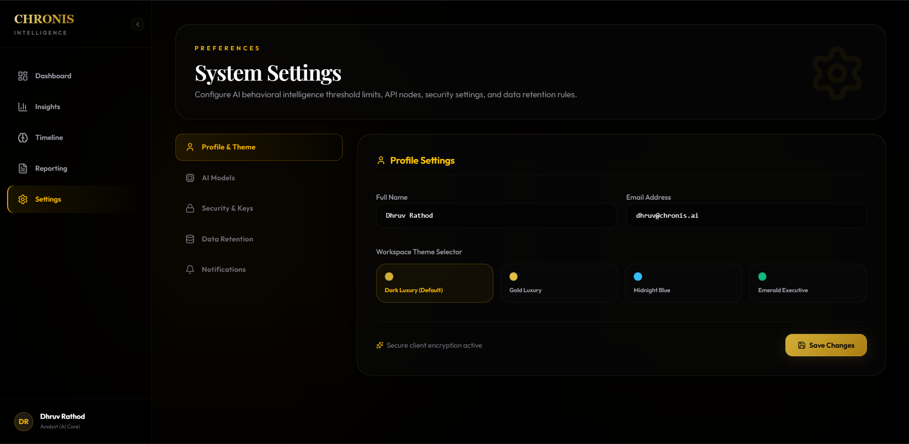

# Chronis

AI-Powered Behavioral Intelligence Platform

## Overview

Chronis is a behavioral intelligence platform designed to help users explore behavioral trends, understand AI-generated insights, and track long-term behavioral evolution through an intuitive and explainable interface.

The application transforms behavioral signals into meaningful insights using visual analytics, confidence indicators, evidence-based explanations, and narrative timelines.

This project was developed as part of the Chronis Product & App Engineer Assessment (Task C).

---

## Features

### Dashboard

* Behavioral Trend Analytics
* Confidence Indicators
* Behavioral Score Metrics
* AI Engine Status
* Radar Metrics
* Activity Feed
* Productivity Trend Visualization
* Recent Intelligence Logs

### Insight Explorer

* Detailed Insight Analysis
* Supporting Evidence Cards
* Confidence Indicators
* Missing Data Explanations
* AI Narrative Explanations
* Behavioral Recommendations

### Narrative Timeline

* Historical Behavioral Events
* Behavioral Evolution Tracking
* Chronological Insight Presentation
* Timeline Navigation

### Reporting Center

* Weekly Reports
* Monthly Reports
* Report History
* Export Actions
* Intelligence Summaries

### Settings

* User Preferences
* Notification Settings
* Theme Controls
* AI Preferences
* Profile Management

### Authentication UI

* Login Interface
* Signup Interface
* Forgot Password Interface

---

## Design Goals

Chronis was designed with a focus on:

* Explainability
* Transparency
* Product Thinking
* User Experience
* Responsive Design
* Behavioral Intelligence Visualization

The interface uses a premium luxury design language featuring a dark theme, gold accents, glassmorphism-inspired cards, smooth animations, and high-information-density layouts.

---

## Tech Stack

### Frontend

* React
* TypeScript
* Vite
* Tailwind CSS

### Visualization

* Recharts

### Animation

* Framer Motion

### Utilities

* React CountUp

---

## Project Structure

```text
client/
├── src/
│   ├── components/
│   ├── pages/
│   ├── data/
│   ├── hooks/
│   └── styles/
│
├── public/
├── package.json
└── vite.config.ts
```

---

## Installation

Clone the repository:

```bash
git clone https://github.com/dhruvrathod45/chronis.git
```

Move into the project:

```bash
cd chronis/client
```

Install dependencies:

```bash
npm install
```

Run locally:

```bash
npm run dev
```

---

## Build

Create a production build:

```bash
npm run build
```

---

## Screenshots

Add screenshots here before submission:

### Dashboard



### Insight Explorer



### Timeline



### Reporting



### Settings



---

## Product Decisions

See:

```text
product-rationale.md
```

for:

* Three UX Decisions
* One Tradeoff
* One Future Feature

---

## Future Improvements

* Predictive Behavioral Forecasting
* Personalized AI Coaching
* Real-Time Behavioral Signal Processing
* Advanced Reporting Engine
* Behavioral Anomaly Detection
* Team & Organization Dashboards

---

## Author

Dhruv Rathod

GitHub:
https://github.com/dhruvrathod45

LinkedIn:
https://www.linkedin.com/in/dhruvrathod45/

---

## License

This project was created for educational and assessment purposes.
